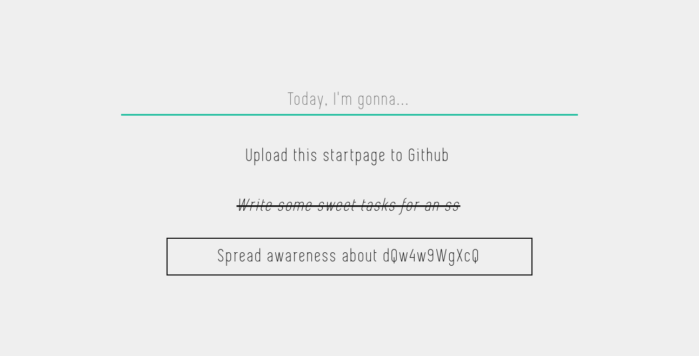

# ToDo-Startpage

ToDo-Startpage is a super minimalistic to-do list which you can use as your startpage!

## Example




## Installation

### Website

Set your browser's startpage/homepage to point to `https://mradigen.github.io/todo-startpage/`. If you aren't sure on how to do that, a simple search `how to set a startpage on <browser>` on the Internet shall yield you results.

### Locally
Clone this repository where you'd like.

```bash
git clone https://github.com/mradigen/todo-startpage.git
```

Set it as a startpage/homepage in your browser. If you aren't sure on how to do that, a simple search `how to set a startpage on <browser>` on the Internet shall yield you results.

## Usage

Left click to toggle strike-through.

Right click to toggle target.

Double left click to delete.

Left click anywhere else to toggle theme.

Tasks are stored in your `localStorage`, so you don't need to worry about losing them!

## To-do

- Add some sort of custom themes and be able to switch between them.

## Contributing
If you have any ideas for modifications, feel free to fork this repository! I'd love to see them!

## License
[MIT](./LICENSE)

